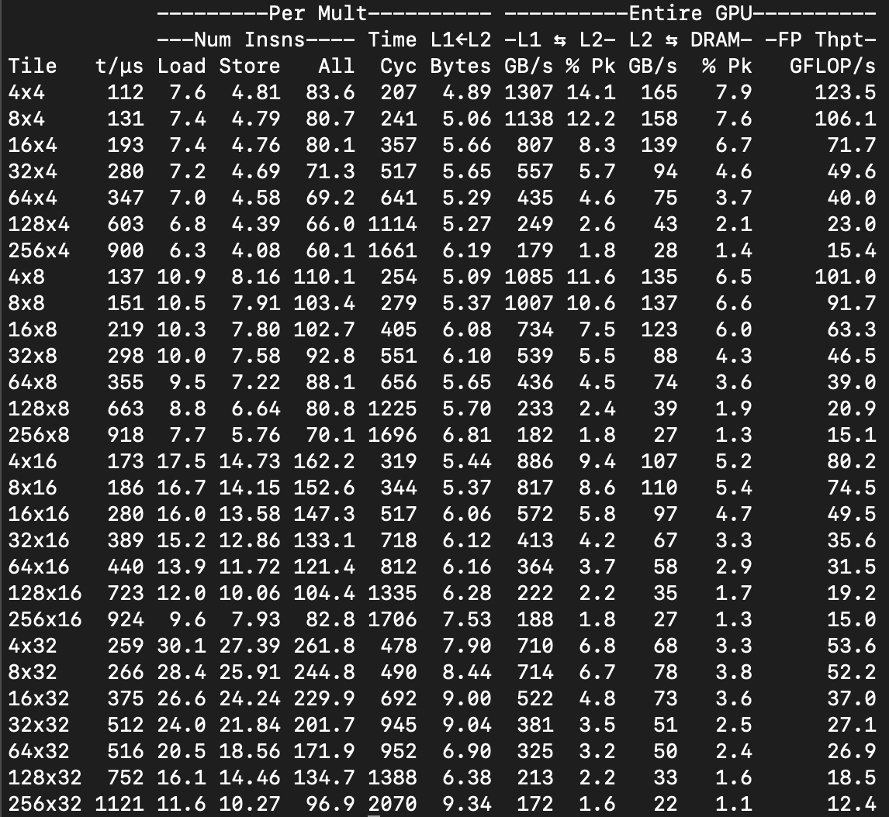

# Flex
SpMM: Sparse-dense matrix multiplication

## Complile
- Run `./compile.sh`

## Run
- Run `./run.sh`

## Example Data:
|                |      size     | #non-zeros |
|:--------------:|:-------------:|:----------:|
| Sparse(Pubmed) | 19717 X 19717 |   108365   |
|      Dense     |  19717 X 128  |            |

<//>:# (## Outputs)
<//>:# ()
